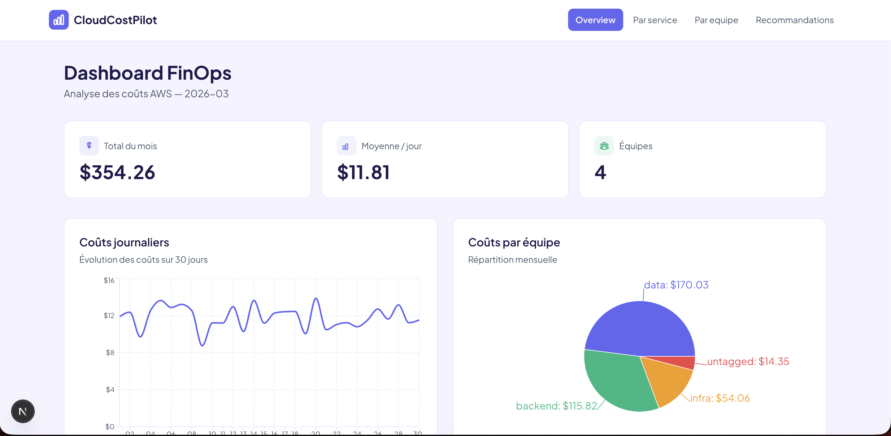

# CloudCostPilot

> Outil FinOps serverless sur AWS. Ingère les Cost & Usage Reports, détecte les gaspillages, alerte en cas d'anomalie et expose les données via une API REST et un dashboard.

**Stack** : AWS Lambda · Terraform · Python 3.11 · DynamoDB · API Gateway · Next.js · GitHub Actions
**Coût de fonctionnement** : < $1 / mois · **Latence API** : < 100ms · **Tests** : 11 · **CI/CD** : automatisée



---

## Pourquoi ce projet

Le FinOps est l'un des postes d'économie les plus sous-exploités en entreprise — on estime que **30 % des dépenses cloud sont du gaspillage pur**. J'ai construit CloudCostPilot pour démontrer concrètement les compétences DevOps/Cloud que je veux mettre au service d'une alternance : **Infrastructure as Code, serverless event-driven, observabilité des coûts, et industrialisation (CI/CD, tests, sécurité).**

Le projet est entièrement fonctionnel, déployé sur mon compte AWS personnel, avec un budget maîtrisé sous $15 grâce aux bonnes pratiques FinOps que l'outil lui-même applique.

---

## Architecture

```
┌──────────────────┐      ┌─────────────────────┐      ┌──────────────────┐
│  AWS Billing     │─────▶│  S3 (CUR reports)   │─────▶│  Lambda          │
│  Cost & Usage    │      │  Parquet quotidien  │      │  Ingestion       │
│  Reports         │      └─────────────────────┘      │  (Python 3.11)   │
└──────────────────┘                                    └────────┬─────────┘
                                                                 │
                                                                 ▼
┌──────────────────┐      ┌─────────────────────┐      ┌──────────────────┐
│  EventBridge     │─────▶│  Lambda Detective   │      │  DynamoDB        │
│  cron quotidien  │      │  4 règles FinOps    │─────▶│  single-table    │
└──────────────────┘      └──────┬──────────────┘      │  on-demand       │
                                 │                     └────────┬─────────┘
                                 ▼                              │
                         ┌───────────────┐                      │
                         │  SNS Topic    │                      ▼
                         │  email alerts │           ┌──────────────────┐
                         └───────────────┘           │  API Gateway     │
                                                     │  HTTP API + Lambda│
                                                     └────────┬─────────┘
                                                              │
                                                              ▼
                                                    ┌──────────────────┐
                                                    │  Dashboard       │
                                                    │  Next.js/Vercel  │
                                                    └──────────────────┘
```

### Flux d'exécution

1. **Ingestion** — AWS dépose un CUR Parquet dans S3 → trigger S3 → Lambda parse, enrichit, écrit dans DynamoDB en 4 secondes
2. **Détection** — EventBridge déclenche chaque matin une Lambda qui applique 4 règles FinOps et publie les alertes sur SNS
3. **API** — 6 endpoints REST (costs, recommendations, anomalies) exposés via API Gateway avec CORS
4. **Dashboard** — frontend Next.js/TypeScript hébergé sur Vercel, graphiques Recharts

---

## Ce que le projet démontre

### Infrastructure as Code — Terraform

- **Remote state S3 + locking DynamoDB** pour un travail en équipe sans corruption
- **9 fichiers Terraform** organisés par domaine (s3.tf, iam.tf, lambda.tf…)
- **Moindre privilège IAM** : chaque policy cible une ressource précise (pas de `"Resource": "*"`)
- **Default tags** sur toutes les ressources (Project, ManagedBy, Environment)
- **Reproductibilité prouvée** : `terraform destroy && terraform apply` recrée tout en 10 secondes

### Serverless event-driven — Lambda

- **Architecture propre** : handler → parser → enricher → storage, chaque module testable indépendamment
- **Injection de dépendance** : les clients boto3 sont passés en paramètre, ce qui permet le mocking avec `moto`
- **Lambda Layer** `AWSSDKPandas` pour garder le .zip à **8 Ko** (dépendances pandas/pyarrow hors zip)
- **Optimisation mémoire** : 256 Mo → 215 Mo utilisés, cold start de 2.5s

### Data & NoSQL — DynamoDB

- **Single-table design** (pattern Rick Houlihan) : PK/SK avec préfixes (`DAILY#`, `TAG#`, `RECOMMENDATION#`)
- **Mode on-demand** : gratuit sous le Free Tier, scale automatiquement
- **TTL** pour auto-purger les données de plus de 90 jours
- **Piège `Decimal` vs `float`** correctement géré (erreur classique avec boto3)

### Détection de gaspillages — FinOps

| Règle | Technique de détection |
|-------|------------------------|
| Volumes EBS orphelins | `ec2:DescribeVolumes` filtré sur `status=available` |
| Elastic IPs inutilisées | `ec2:DescribeAddresses` sans `InstanceId` |
| Ressources non taggées | Analyse des tags CUR via DynamoDB |
| Anomalies de coût | Moyenne mobile 7 jours, seuil +50% |

### Industrialisation — CI/CD GitHub Actions

- **`test.yml`** : pytest (11 tests) + ruff lint à chaque push/PR
- **`security.yml`** : bandit (failles Python) + checkov (failles Terraform)
- **Cache pip** pour accélérer les pipelines
- **Python 3.11** aligné avec le runtime Lambda pour éliminer les écarts dev/prod

### Frontend — Next.js

- **4 pages** : overview (KPIs + line chart + pie chart), par service (bar chart), par équipe (barres de progression), recommandations
- **Server Components** pour le fetch des données, Client Components uniquement pour Recharts
- **Design system** flat SaaS avec palette accessible (contraste WCAG AAA)
- **Déployé sur Vercel** avec preview deployments automatiques

---

## Stack technique détaillée

| Couche | Technologies | Pourquoi |
|--------|-------------|----------|
| **IaC** | Terraform 1.14 + remote state S3/DynamoDB | Reproductibilité, traçabilité via Git, rollback possible |
| **Compute** | AWS Lambda (Python 3.11) | Pay-per-use, 0 maintenance serveur, scale auto |
| **Storage** | S3 (cold, brut) + DynamoDB (hot, enrichi) | Pattern medallion — brut froid, enrichi chaud |
| **API** | API Gateway HTTP API v2 | 3.5× moins cher que REST API v1 |
| **Scheduling** | EventBridge (cron serverless) | Remplace un crontab Linux, gratuit |
| **Alerting** | SNS (email + potentiel Slack webhook) | Pub/sub découplé |
| **Tests** | pytest + moto | Mock AWS en mémoire → tests en 2s, $0 |
| **Sécurité** | bandit + checkov (CI/CD) | Scan avant déploiement |
| **Frontend** | Next.js 16 + TypeScript + Tailwind + Recharts | Moderne, SSR pour le SEO, typage strict |
| **Hébergement UI** | Vercel | CI/CD intégré, preview deployments |

---

## Coûts du projet (réels, constatés)

| Ressource | Coût mensuel |
|-----------|--------------|
| Lambda (ingestion + detection + API) | ~$0.01 |
| DynamoDB on-demand | ~$0.00 (sous le Free Tier) |
| S3 (CUR + artifacts + tfstate) | ~$0.03 |
| API Gateway HTTP API | ~$0.00 (à faible trafic) |
| SNS | ~$0.00 |
| EventBridge | $0.00 (30 invocations / mois) |
| **Total mensuel** | **< $0.10** |

**Budget AWS max configuré : $15 avec alertes à $5 / $10 / $15.**

---

## Sécurité

- **MFA** obligatoire sur le compte root et l'utilisateur IAM dédié
- **Aucun secret** dans le code ou sur GitHub (scannés automatiquement par bandit)
- **State Terraform chiffré** dans S3 (SSE-S3 AES-256) avec block public access
- **Least privilege IAM** sur toutes les Lambdas
- **checkov** en CI pour détecter les mauvaises pratiques Terraform avant merge

---

## Roadmap

- [x] Phase 0 — Setup environnement AWS, outils, CUR
- [x] Phase 1 — Infrastructure Terraform (S3, DynamoDB, IAM, remote state)
- [x] Phase 2 — Lambda d'ingestion (parser Parquet, enricher, storage, 11 tests)
- [x] Phase 3 — Détection FinOps + API REST + alertes SNS
- [x] Phase 4 — Dashboard Next.js + graphiques Recharts
- [x] Phase 5 — CI/CD GitHub Actions (tests + security scan)
- [ ] Multi-account AWS Organizations
- [ ] Détection d'anomalies par ML (scikit-learn)
- [ ] Support Azure Cost Management (multi-cloud)

---

## Structure du projet

```
CloudCostPilot/
├── .github/workflows/    # CI/CD GitHub Actions
├── api/                  # Handler API Gateway
├── frontend/             # Dashboard Next.js
├── infra/                # Modules Terraform (S3, DynamoDB, IAM, Lambda, API Gateway…)
├── lambdas/
│   ├── ingestion/        # Parsing CUR Parquet + agrégation DynamoDB
│   └── detection/        # Règles FinOps + SNS
├── scripts/              # Scripts de build des Lambdas
├── tests/                # Tests pytest + fixtures CUR
├── requirements.txt      # Dépendances prod (boto3, pandas, pyarrow)
└── requirements-dev.txt  # Dépendances dev (pytest, moto, ruff, bandit)
```

---

## À propos

**Dominique Huang** — 18 ans, développeur full-stack en alternance (URSSAF, Java/Angular), je prépare la certification **AWS Solutions Architect Associate** et cherche une **alternance DevOps/Cloud Engineer** pour la rentrée 2026 en Master MIAGE.

Ce projet est ma façon de prouver que je ne connais pas seulement la théorie du cloud AWS mais que je sais aussi **concevoir, implémenter, tester, déployer et industrialiser** une solution complète — le tout en restant sous $1 / mois grâce aux bonnes pratiques FinOps que l'outil lui-même applique.

**Contact** : dominique@dominique-huang.fr
